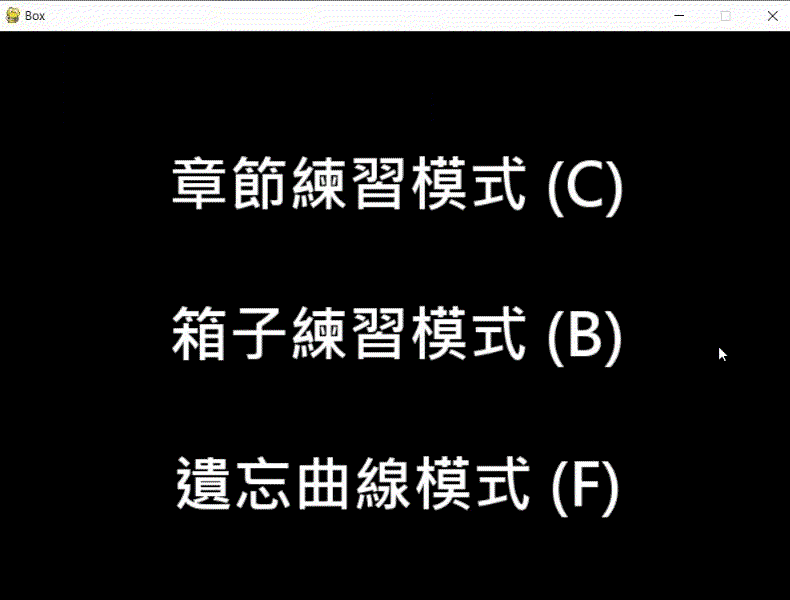
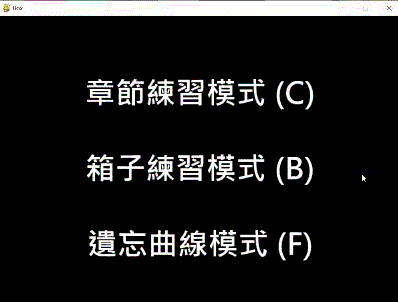
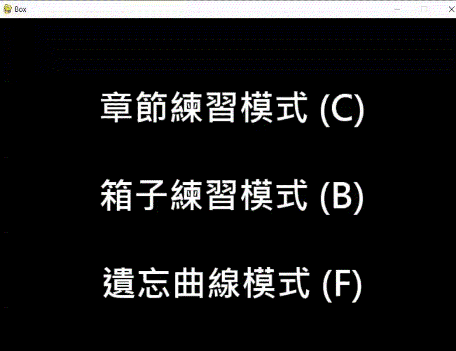

# self-help_English
```
為了拯救我可憐的英文，於是寫了一個心中的背單字程式XD
```

<b>適合族群 :</b>
* 每次看單字都想不起中文的人。
* 背單字時眼睛會不小心喵到中文的人。
* 背單字潛意識會把順序記下來的人。

<b>優點 : </b>
* 結合 Ebbinghaus 遺忘曲線 的概念(學習卡片箱)，幫助記憶。
* 提供兩種練習模式，不會影響到你的遺忘曲線優良紀錄XD。
* 不只適用於英翻中，各國語言皆可(精靈語或許也行)。
* 可客製化配置自己的單字。

<b>缺點 : </b>
* 需要懂怎麼執行 python(pandas弄成exe檔太大 XD)
* 有些人不喜歡客製化配置 (可能覺得麻煩)

---
## 操作方法
<div><b>空白鍵 : </b> 顯示中文。</div>
<div><b>鍵 a : </b> 內心默念的答案對了，前往下一個。</div>
<div><b>鍵 d : </b> 內心默念的答案錯了，前往下一個。</div>
<div><b>鍵 m : </b> 回主選單。</div>

## 呈現
### Chapter Mode (練習模式，不會記錄)


### Box Mode (練習模式，不會記錄)


### Forget Curve Mode (遺忘曲線模式，紀錄)


---
## 如何執行
* <b>安裝</b>
```
$ cd <PATH>/self-help_ENG
$ pip install -r requirements.txt
```
* <b>執行</b>
```bash
$ cd <PATH>/self-help_ENG/cfg
$ python Self_Help_Words.py
```


